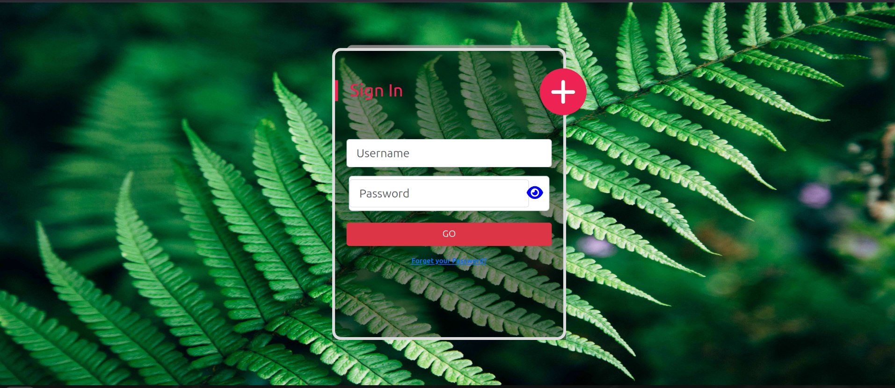

# Sign In/Sign Up Page with Angular

A stylish and animated sign-in/sign-up page built with Angular, featuring dynamic background images, smooth animations, and a modern design. Bootstrap and FontAwesome are used for responsive layouts and icons.

## Table of Contents

- [Features](#features)
- [Installation](#installation)
- [Usage](#usage)
- [Customization](#customization)
- [Test Users](#test-users)
- [Contributing](#contributing)
- [License](#license)
- [Acknowledgements](#acknowledgements)

## Features

- User-friendly sign-in and sign-up forms.
- Beautiful background with changing images.
- Smooth CSS animations for enhanced user experience.
- Fully responsive design using Bootstrap.
- FontAwesome icons for stylish input fields and buttons.
- Easy to customize design and animations.

## Installation

### Prerequisites

- Node.js (v14 or higher)
- Angular CLI

### Steps

1. Clone the repository:

    ```bash
    git clone https://github.com/username/project-name.git
    ```

2. Navigate to the project directory:

    ```bash
    cd project-name
    ```

3. Install the dependencies:

    ```bash
    npm install
    ```

## Usage

To run the application locally:

1. Start the Angular development server:

    ```bash
    ng serve
    ```

2. Open your browser and navigate to:

    ```
    http://localhost:4200
    ```

## Screenshots

Include some screenshots or GIFs of your page in action (showing the background change and animation effects).
<table>
  <tr>
    <td></td>
    <td></td>
  </tr>
  <tr>
    <td></td>
    <td></td>
  </tr>
</table>

<hr/>

https://github.com/user-attachments/assets/c4160e92-ea20-43e3-a070-2f4359816caf

## Customization

### Background Images

The page has a dynamic background with beautiful images. To change the background images, replace the image files in the `assets/images` directory.

### Animations

The page includes smooth animations for transitions. You can modify or add new animations in the `styles.css` file.


## Test Users

To test the sign-in and sign-up functionality, you can use the following pre-defined user data in the `UsersPasswordsDBService`:

You can use these accounts to test the authentication process on the page:

- **Admin account**
  - Username: `admin`
  - Password: `admin`
  
- **User account**
  - Username: `user`
  - Password: `user`
  
- **Guest account**
  - Username: `guest`
  - Password: `guest`
  
- **Test account**
  - Username: `test`
  - Password: `test`

## Contributing

Contributions are welcome!

1. Fork the repository.
2. Create a feature branch:

    ```bash
    git checkout -b feature-name
    ```

3. Commit changes:

    ```bash
    git commit -m "Add new feature"
    ```

4. Push to the branch:

    ```bash
    git push origin feature-name
    ```

5. Submit a pull request.

## License

This project is licensed under the MIT License. See the LICENSE file for details.

## Acknowledgements

- **Angular** - The framework used for building the project.
- **Bootstrap** - Provides responsive design and layout components.
- **FontAwesome** - Used for adding stylish icons.
- **All contributors** - Thanks to everyone who has contributed to this project.
